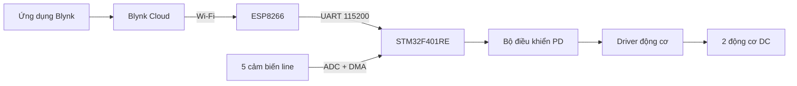

# 🚗 Xe Dò Line Thông Minh — STM32 + ESP8266 + Blynk


> Robot hai bánh có khả năng **tự động bám line bằng điều khiển PD** và **điều khiển từ xa qua ứng dụng Blynk**. STM32 đảm nhiệm xử lý thời gian thực; ESP8266 kết nối Wi‑Fi và chuyển lệnh từ điện thoại tới xe qua UART.

## 🌟 Tổng quan

Dự án kết hợp hai bộ điều khiển:

- **NUCLEO-F401RE:** đọc 5 cảm biến analog bằng ADC + DMA, tính sai số bám line và điều khiển hai động cơ bằng PWM.
- **ESP8266:** kết nối Blynk Cloud qua Wi‑Fi, nhận thao tác từ ứng dụng và gửi lệnh một ký tự tới STM32.

Xe có hai chế độ:

1. **Auto mode:** tự động dò và bám theo đường line.
2. **Remote mode:** điều khiển tiến, lùi, trái, phải và dừng từ điện thoại.

## ✨ Tính năng nổi bật

- Đọc đồng thời 5 cảm biến analog với ADC 12-bit.
- DMA vòng tròn cập nhật dữ liệu cảm biến liên tục.
- Điều khiển bám line bằng sai số có trọng số và thuật toán PD.
- Tự tìm lại line theo hướng sai số cuối cùng khi mất vạch.
- Hai kênh PWM điều khiển độc lập tốc độ hai động cơ.
- Điều khiển chiều quay tiến/lùi cho từng động cơ.
- Chuyển đổi giữa Auto mode và Remote mode ngay trên Blynk.
- ESP8266 gửi lệnh qua UART ở tốc độ 115200 baud.
- STM32 tự khởi động lại ngắt nhận khi UART gặp lỗi overrun, noise hoặc framing.
- Khi nhả nút điều hướng trên Blynk, ESP8266 gửi lệnh dừng ngay lập tức.

## 🧩 Kiến trúc hệ thống



STM32 chịu trách nhiệm điều khiển trực tiếp nên việc bám line không phụ thuộc vào Internet. Blynk và ESP8266 chỉ phục vụ chế độ điều khiển từ xa.

## 🧠 Thuật toán dò line

Năm cảm biến được gán các trọng số:

```text
Cảm biến:   S1     S2     S3     S4     S5
Trọng số:  -20    -10      0     10     20
```

Sai số vị trí:

```text
error = Σ(giá trị cảm biến × trọng số) / Σ(giá trị cảm biến)
```

Giá trị hiệu chỉnh PD:

```text
control = Kp × error + Kd × (error − previous_error)
```

Tốc độ động cơ:

```text
motor_left  = BASE_SPEED + control
motor_right = BASE_SPEED − control
```

| Thông số | Giá trị hiện tại | Ý nghĩa |
|---|---:|---|
| `Kp` | `1.5` | Mức phản ứng theo sai số hiện tại |
| `Kd` | `20.0` | Giảm dao động theo độ biến thiên sai số |
| `BASE_SPEED` | `550` | Tốc độ cơ sở |
| `MAX_PWM` | `1000` | Giới hạn PWM |
| Chu kỳ điều khiển | khoảng `2 ms` | Độ trễ vòng lặp Auto mode |

> Thuật toán hiện tại là **PD**, chưa sử dụng thành phần tích phân `Ki`.

## 🔌 Kết nối phần cứng

### Cảm biến dò line → STM32

| Cảm biến | Chân STM32 | Kênh ADC |
|---|---|---|
| S1 | `PA0` | `ADC1_IN0` |
| S2 | `PA1` | `ADC1_IN1` |
| S3 | `PA4` | `ADC1_IN4` |
| S4 | `PB0` | `ADC1_IN8` |
| S5 | `PC1` | `ADC1_IN11` |

### Driver động cơ → STM32

| Chức năng | Chân STM32 |
|---|---|
| PWM động cơ trái | `PA8` — `TIM1_CH1` |
| PWM động cơ phải | `PA9` — `TIM1_CH2` |
| Chiều động cơ trái 1 | `PB12` |
| Chiều động cơ trái 2 | `PB13` |
| Chiều động cơ phải 1 | `PB14` |
| Chiều động cơ phải 2 | `PB15` |

### ESP8266 → STM32

| ESP8266 | STM32F401RE | Chức năng |
|---|---|---|
| `TX` | `PA10` — USART1 RX | Gửi lệnh điều khiển tới STM32 |
| `GND` | `GND` | Nối chung mass |

STM32 cũng cấu hình USART1 TX tại `PB6`, nhưng chương trình ESP8266 hiện tại chỉ gửi dữ liệu một chiều nên không bắt buộc kết nối chân này.

> ESP8266 sử dụng logic **3.3 V**. Hãy dùng nguồn 3.3 V ổn định, đủ dòng và luôn nối chung GND giữa STM32, ESP8266, cảm biến và driver động cơ.

## 🎮 Giao thức điều khiển UART

ESP8266 gửi từng ký tự ASCII tới STM32:

| Lệnh | Chức năng |
|:---:|---|
| `M` | Chuyển đổi giữa Auto mode và Remote mode |
| `F` | Tiến |
| `B` | Lùi |
| `L` | Quay trái |
| `R` | Quay phải |
| `S` | Dừng |

Khi nhận `M`, STM32 dừng hai động cơ trước khi chuyển chế độ. Khi một nút điều hướng được giữ, ESP8266 gửi lại lệnh tương ứng sau mỗi 100 ms; khi nhả nút, lệnh `S` được gửi ngay.

## 📱 Cấu hình Blynk

Tạo một Template và năm Datastream kiểu **Virtual Pin**, giá trị nguyên từ `0` đến `1`:

| Virtual Pin | Widget đề xuất | Chức năng | Chế độ nút |
|:---:|---|---|---|
| `V0` | Button | Tiến | Push |
| `V1` | Button | Lùi | Push |
| `V2` | Button | Trái | Push |
| `V3` | Button | Phải | Push |
| `V4` | Button | Đổi Auto/Remote | Push |

Bố trí gợi ý:

```text
              [ TIẾN - V0 ]

[ TRÁI - V2 ] [ DỪNG KHI NHẢ ] [ PHẢI - V3 ]

               [ LÙI - V1 ]

             [ ĐỔI MODE - V4 ]
```

Sau khi tạo Device từ Template, lấy ba thông tin từ Blynk Console và điền vào chương trình ESP8266:

```cpp
#define BLYNK_TEMPLATE_ID   "YOUR_TEMPLATE_ID"
#define BLYNK_TEMPLATE_NAME "YOUR_TEMPLATE_NAME"
#define BLYNK_AUTH_TOKEN    "YOUR_AUTH_TOKEN"

char ssid[] = "YOUR_WIFI_NAME";
char pass[] = "YOUR_WIFI_PASSWORD";
```

### 🔐 Bảo mật thông tin kết nối

Không commit Auth Token, tên Wi‑Fi hoặc mật khẩu thật lên repository công khai. Nên đặt chúng trong file riêng, ví dụ `secrets.h`:

```cpp
#pragma once

#define BLYNK_TEMPLATE_ID   "YOUR_TEMPLATE_ID"
#define BLYNK_TEMPLATE_NAME "YOUR_TEMPLATE_NAME"
#define BLYNK_AUTH_TOKEN    "YOUR_AUTH_TOKEN"

const char WIFI_SSID[] = "YOUR_WIFI_NAME";
const char WIFI_PASS[] = "YOUR_WIFI_PASSWORD";
```

Sau đó thêm file này vào `.gitignore`:

```gitignore
secrets.h
```

Bạn có thể commit một file `secrets.example.h` chỉ chứa giá trị mẫu để người khác biết cách cấu hình.

## 🗂️ Cấu trúc repository đề xuất

```text
stm32-linefollowingrobot/
├── Core/
│   ├── Inc/                       # Header STM32
│   ├── Src/                       # Mã nguồn STM32
│   └── Startup/                   # Startup code
├── Drivers/
│   ├── CMSIS/
│   └── STM32F4xx_HAL_Driver/
├── esp8266_blynk/
│   ├── esp8266_blynk.ino          # Chương trình ESP8266
│   └── secrets.example.h          # Cấu hình mẫu, không chứa bí mật thật
├── xe_do_line_vip.ioc             # Cấu hình STM32CubeMX
├── STM32F401RETX_FLASH.ld
├── STM32F401RETX_RAM.ld
├── .gitignore
└── README.md
```

Mã chính của STM32 nằm trong `Core/Src/main.c`; mã kết nối Blynk nằm trong `esp8266_blynk/esp8266_blynk.ino`.

## 🚀 Cài đặt và chạy

### 1. Nạp chương trình STM32

1. Cài [STM32CubeIDE](https://www.st.com/en/development-tools/stm32cubeide.html).
2. Chọn **File → Open Projects from File System**.
3. Chọn thư mục gốc của dự án và nhấn **Finish**.
4. Kết nối NUCLEO-F401RE với máy tính qua USB/ST-LINK.
5. Chọn **Project → Build Project**.
6. Nhấn **Run** hoặc **Debug** để nạp firmware.

### 2. Nạp chương trình ESP8266

1. Cài Arduino IDE.
2. Cài board package **ESP8266 by ESP8266 Community** trong Boards Manager.
3. Cài thư viện **Blynk** trong Library Manager.
4. Mở `esp8266_blynk.ino`.
5. Điền Blynk Template, Auth Token và thông tin Wi‑Fi của bạn.
6. Chọn đúng loại board ESP8266 và đúng cổng COM.
7. Nhấn **Upload**.
8. Nối TX của ESP8266 với `PA10` của STM32 và nối chung GND.

### 3. Chạy thử

1. Kê bánh xe khỏi mặt đất trong lần thử đầu tiên.
2. Cấp nguồn cho toàn bộ hệ thống.
3. Chờ ESP8266 kết nối Wi‑Fi và Blynk Cloud.
4. Nhấn `V4` để chuyển sang Remote mode.
5. Thử lần lượt các nút tiến, lùi, trái và phải.
6. Chuyển về Auto mode và đặt xe lên đường line để kiểm tra khả năng bám đường.

## 🎯 Hiệu chỉnh xe

Các thông số chính nằm ở đầu `Core/Src/main.c`:

```c
#define MAX_PWM     1000
#define BASE_SPEED  550
float Kp = 1.5f;
float Kd = 20.0f;
```

Gợi ý:

1. Bắt đầu với tốc độ thấp.
2. Tăng `Kp` nếu xe phản ứng chậm hoặc không ôm được cua.
3. Giảm `Kp` nếu xe lắc trái-phải quá mạnh.
4. Tăng `Kd` để giảm dao động; giảm `Kd` nếu xe phản ứng quá gắt.
5. Chỉ tăng `BASE_SPEED` sau khi xe đã bám line ổn định.

Ngưỡng cảm biến hiện tại:

```c
if (val < 1000) val = 0;
```

Hãy đo giá trị cảm biến trên nền sáng và vạch tối rồi điều chỉnh ngưỡng cho phù hợp với môi trường thực tế.

## 🛠️ Xử lý sự cố

| Hiện tượng | Kiểm tra |
|---|---|
| Xe chạy ngược | Đảo dây động cơ hoặc logic chân điều khiển chiều |
| Xe luôn lệch một bên | Kiểm tra thứ tự cảm biến và độ cân bằng hai động cơ |
| Xe lắc liên tục | Giảm `Kp`, điều chỉnh `Kd` hoặc giảm `BASE_SPEED` |
| Xe không nhận line | Kiểm tra nguồn cảm biến, chân ADC và ngưỡng `1000` |
| ESP8266 không online | Kiểm tra Wi‑Fi 2.4 GHz, thông tin đăng nhập và Blynk token |
| Blynk online nhưng xe không chạy | Kiểm tra đã chuyển Remote mode, dây TX → PA10 và GND chung |
| Xe không dừng khi mất mạng | Firmware hiện chưa có timeout an toàn; tắt nguồn động cơ và bổ sung watchdog lệnh |
| ESP8266 khởi động lại | Kiểm tra nguồn 3.3 V có đủ dòng và ổn định hay không |
| STM32 không nhận UART | Kiểm tra cả hai bên đều dùng 115200 baud |

## ⚠️ Lưu ý an toàn

- Thử xe với bánh được kê khỏi mặt đất trước khi chạy thật.
- Luôn có cách ngắt nguồn động cơ nhanh chóng.
- Firmware hiện tại chưa tự dừng nếu ESP8266 mất mạng trong lúc một lệnh di chuyển đang được giữ.
- Không cấp điện áp 5 V trực tiếp vào chân GPIO của ESP8266.
- Không thay đổi dây nối khi hệ thống đang được cấp nguồn.

## 🛣️ Hướng phát triển

- Thêm timeout để STM32 tự dừng nếu không nhận lệnh mới trong một khoảng thời gian.
- Hiển thị chế độ hiện tại và trạng thái kết nối trên Blynk.
- Gửi dữ liệu 5 cảm biến về ứng dụng để giám sát.
- Thêm tự động hiệu chuẩn cảm biến khi khởi động.
- Bổ sung bộ lọc ADC và điều chỉnh tốc độ theo độ cong đường line.
- Lưu `Kp`, `Kd` và tốc độ vào Flash.
- Thêm đo điện áp pin và cơ chế dừng khẩn cấp.

## 🤝 Đóng góp

Mọi góp ý, báo lỗi và cải tiến đều được chào đón. Bạn có thể tạo **Issue** hoặc gửi **Pull Request** để cùng hoàn thiện dự án.

---

Nếu dự án hữu ích, hãy để lại một ⭐ cho repository!
