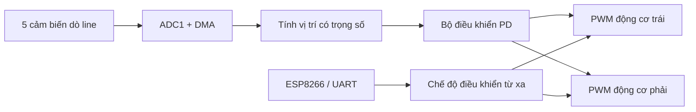

# 🚗 Xe Dò Line Thông Minh với STM32F401RE


> Robot dò line hai bánh sử dụng **5 cảm biến analog**, thuật toán điều khiển **PD**, đọc cảm biến bằng **ADC + DMA** và điều khiển từ xa qua **ESP8266/UART**.

## 🌟 Tổng quan

Dự án xây dựng một xe robot có hai chế độ hoạt động:

- **Tự động dò line:** đọc đồng thời 5 cảm biến, ước lượng vị trí vạch và điều chỉnh tốc độ hai động cơ bằng bộ điều khiển PD.
- **Điều khiển từ xa:** nhận lệnh từ ESP8266 qua UART để tiến, lùi, rẽ trái, rẽ phải hoặc dừng.

Hệ thống chạy trên bo **NUCLEO-F401RE** với xung nhịp 84 MHz. ADC hoạt động liên tục cùng DMA, giúp việc lấy mẫu cảm biến diễn ra nhanh mà không làm gián đoạn vòng điều khiển chính.

## ✨ Tính năng nổi bật

- Đọc 5 cảm biến analog bằng ADC 12-bit.
- DMA chế độ vòng tròn để cập nhật dữ liệu cảm biến liên tục.
- Điều khiển bám line bằng sai số có trọng số.
- Bộ điều khiển PD với tham số có thể tinh chỉnh.
- Hai kênh PWM riêng biệt điều khiển tốc độ hai động cơ.
- Điều khiển chiều quay tiến/lùi cho từng động cơ.
- Chuyển đổi nhanh giữa chế độ tự động và điều khiển từ xa.
- Nhận lệnh UART bằng ngắt, tốc độ 115200 baud.
- Tự khôi phục nhận UART khi gặp lỗi overrun, noise hoặc framing.
- Tự tìm lại line theo hướng sai số cuối cùng khi mất vạch.

## 🧠 Nguyên lý hoạt động



Mỗi cảm biến được gán một trọng số:

```text
Cảm biến:   S1     S2     S3     S4     S5
Trọng số:  -20    -10      0     10     20
```

Sai số vị trí được tính theo trung bình có trọng số:

```text
error = Σ(giá trị cảm biến × trọng số) / Σ(giá trị cảm biến)
```

Giá trị hiệu chỉnh:

```text
control = Kp × error + Kd × (error − previous_error)
```

Tốc độ hai động cơ:

```text
motor_left  = BASE_SPEED + control
motor_right = BASE_SPEED − control
```

Thông số hiện tại trong chương trình:

| Thông số | Giá trị | Ý nghĩa |
|---|---:|---|
| `Kp` | `1.5` | Mức phản ứng theo sai số hiện tại |
| `Kd` | `20.0` | Giảm dao động dựa trên tốc độ thay đổi sai số |
| `BASE_SPEED` | `550` | Tốc độ cơ sở của xe |
| `MAX_PWM` | `1000` | Giới hạn PWM tối đa |
| Chu kỳ vòng điều khiển | khoảng `2 ms` | Thời gian trễ trong chế độ tự động |

> Thuật toán hiện tại là **PD**, chưa sử dụng thành phần tích phân `Ki`.

## 🔌 Sơ đồ chân

### Cảm biến dò line

| Cảm biến | Chân STM32 | Kênh ADC |
|---|---|---|
| S1 | `PA0` | `ADC1_IN0` |
| S2 | `PA1` | `ADC1_IN1` |
| S3 | `PA4` | `ADC1_IN4` |
| S4 | `PB0` | `ADC1_IN8` |
| S5 | `PC1` | `ADC1_IN11` |

### Driver động cơ

| Chức năng | Chân STM32 |
|---|---|
| PWM động cơ trái | `PA8` — `TIM1_CH1` |
| PWM động cơ phải | `PA9` — `TIM1_CH2` |
| Chiều động cơ trái 1 | `PB12` |
| Chiều động cơ trái 2 | `PB13` |
| Chiều động cơ phải 1 | `PB14` |
| Chiều động cơ phải 2 | `PB15` |

### ESP8266 qua UART

| Chức năng | Chân STM32 |
|---|---|
| USART1 TX | `PB6` |
| USART1 RX | `PA10` |
| Baud rate | `115200` |
| Cấu hình | `8 data bits, no parity, 1 stop bit` |

> Hãy nối chung **GND** giữa STM32, ESP8266, cảm biến và driver động cơ. Kiểm tra mức điện áp logic trước khi cấp nguồn.

## 🎮 Lệnh điều khiển từ xa

ESP8266 gửi từng ký tự qua UART:

| Lệnh | Chức năng |
|:---:|---|
| `M` | Chuyển đổi giữa chế độ dò line và điều khiển từ xa |
| `F` | Tiến |
| `B` | Lùi |
| `L` | Quay trái |
| `R` | Quay phải |
| `S` | Dừng |

Khi nhận lệnh `M`, xe dừng trước khi chuyển chế độ để đảm bảo an toàn.

## 🧰 Phần cứng đề xuất

- Bo phát triển NUCLEO-F401RE.
- Mảng 5 cảm biến dò line có ngõ ra analog.
- Khung xe hai bánh và hai động cơ DC.
- Driver hai động cơ tương thích với tín hiệu PWM và bốn chân điều khiển chiều.
- ESP8266 hoặc thiết bị UART mức logic phù hợp.
- Nguồn cho động cơ và nguồn logic ổn định.
- Dây nối, bánh tự do và đường chạy tương phản tốt.

## 🗂️ Cấu trúc dự án

```text
xe_do_line_vip/
├── Core/
│   ├── Inc/                  # Header của ứng dụng
│   ├── Src/                  # Mã nguồn chính
│   └── Startup/              # Mã khởi động STM32
├── Drivers/
│   ├── CMSIS/                # Thư viện lõi ARM/STM32
│   └── STM32F4xx_HAL_Driver/ # STM32 HAL
├── xe_do_line_vip.ioc        # Cấu hình STM32CubeMX
├── STM32F401RETX_FLASH.ld    # Linker script cho Flash
├── STM32F401RETX_RAM.ld      # Linker script cho RAM
└── README.md
```

Mã điều khiển chính nằm tại [`Core/Src/main.c`](Core/Src/main.c).

## 🚀 Cài đặt và chạy dự án

### 1. Chuẩn bị phần mềm

Cài đặt:

- [STM32CubeIDE](https://www.st.com/en/development-tools/stm32cubeide.html)
- Driver ST-LINK nếu máy chưa tự nhận bo NUCLEO

### 2. Mở dự án

1. Tải repository về máy hoặc chọn **Code → Download ZIP** trên GitHub.
2. Giải nén nếu bạn tải file ZIP.
3. Mở STM32CubeIDE.
4. Chọn **File → Open Projects from File System**.
5. Chọn thư mục `xe_do_line_vip`.
6. Nhấn **Finish**.

### 3. Kết nối phần cứng

1. Đấu cảm biến, driver động cơ và ESP8266 theo bảng chân ở trên.
2. Nối chung GND cho toàn bộ hệ thống.
3. Kết nối NUCLEO-F401RE với máy tính qua cổng USB/ST-LINK.
4. Nên kê bánh xe khỏi mặt đất trong lần thử đầu tiên.

### 4. Build và nạp chương trình

1. Chọn **Project → Build Project**.
2. Sửa mọi lỗi build nếu có.
3. Nhấn **Run** hoặc **Debug** để nạp chương trình qua ST-LINK.
4. Đặt xe lên đường line và kiểm tra chiều quay của hai động cơ.

## 🎯 Hiệu chỉnh xe

Mỗi bộ khung, động cơ và cảm biến sẽ cần thông số khác nhau. Các giá trị cần chỉnh nằm ở đầu file `Core/Src/main.c`:

```c
#define MAX_PWM     1000
#define BASE_SPEED  550
float Kp = 1.5f;
float Kd = 20.0f;
```

Gợi ý hiệu chỉnh:

1. Bắt đầu với tốc độ thấp để tránh xe lao khỏi đường line.
2. Tăng `Kp` nếu xe phản ứng chậm hoặc không ôm được cua.
3. Giảm `Kp` nếu xe lắc trái-phải quá mạnh.
4. Tăng `Kd` nếu cần giảm dao động.
5. Nếu xe rung hoặc phản ứng quá gắt, giảm `Kd`.
6. Chỉ tăng `BASE_SPEED` sau khi xe đã bám line ổn định.

Ngưỡng cảm biến hiện được đặt trực tiếp trong vòng lặp:

```c
if (val < 1000) val = 0;
```

Hãy quan sát giá trị thực tế của cảm biến trên nền sáng và vạch tối rồi điều chỉnh ngưỡng cho phù hợp với điều kiện ánh sáng.

## 🛠️ Xử lý sự cố

| Hiện tượng | Kiểm tra |
|---|---|
| Xe chạy ngược | Đổi hai dây của động cơ hoặc đảo logic chân điều khiển chiều |
| Xe luôn lệch một bên | Kiểm tra thứ tự 5 cảm biến và cân bằng tốc độ hai động cơ |
| Xe lắc liên tục | Giảm `Kp`, điều chỉnh `Kd` hoặc giảm `BASE_SPEED` |
| Xe không nhận line | Kiểm tra nguồn cảm biến, chân ADC và ngưỡng `1000` |
| Xe mất line rồi quay sai hướng | Kiểm tra thứ tự cảm biến và dấu của mảng `weights` |
| Không nhận lệnh ESP8266 | Kiểm tra baud rate 115200, dây TX/RX đấu chéo và GND chung |
| Có PWM nhưng động cơ không chạy | Kiểm tra nguồn động cơ, chân enable và driver công suất |

## 🛣️ Hướng phát triển

- Thêm tự động hiệu chuẩn cảm biến khi khởi động.
- Bổ sung thành phần `Ki` và cơ chế chống bão hòa tích phân.
- Lọc nhiễu ADC bằng trung bình trượt.
- Điều chỉnh tốc độ theo độ cong của đường line.
- Gửi dữ liệu cảm biến và thông số điều khiển về ứng dụng giám sát.
- Lưu cấu hình `Kp`, `Kd` và tốc độ vào Flash.
- Thêm bảo vệ điện áp pin và cơ chế dừng khẩn cấp.

## 🤝 Đóng góp

Mọi góp ý, báo lỗi và cải tiến đều được chào đón. Bạn có thể tạo **Issue** hoặc gửi **Pull Request** để cùng hoàn thiện dự án.

---

Nếu dự án hữu ích, hãy để lại một ⭐ cho repository!
